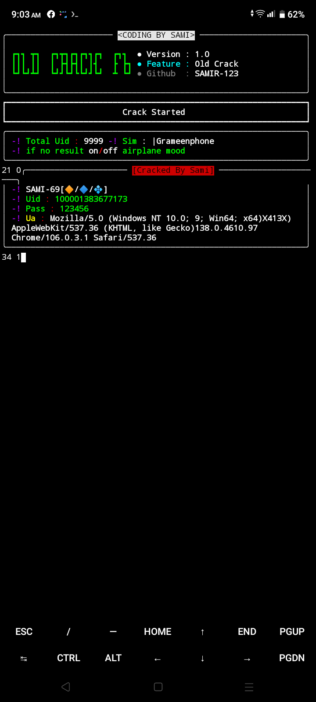

<p align="center">
</p>

</p>
   <p align="center">
      <a href="https://github.com/ZEROX-149/FB-OLD-CRACK/stargazers">
      </a>
      <a href="https://github.com/ZEROX-149/FB-OLD-CRACK/releases/latest">
      </a>
      <a href="https://www.conventionalcommits.org/en/v1.0.0/">
      </a>
      <a href="https://github.com/ZEROX-149/FB-OLD-CRACK/actions/workflows/github-action.yml">
      </a>
   </p>
   
</br>
<p align="center">
> Fb Old Id Craking No Login issu 80% id login 

## Features

- Facebook Old Id Crack
- 2009-2014 Year Old Id Crack
- Fast Cracking
- etc.


## Requirements - 
- Stable Internet Connection
- Termux Version Upto Date
- Android 7 or higher
- No Root
- No Termux Knowlegde

<h4 align="left">TESTED ON > </h4>

* Kali Linux
* Termux
* Mac os
* Ubuntu
* Perrot Sec OS

## Installation

Make sure you have the following prerequisites installed on your system:

- [git](https://git-scm.com/)
- [python](https://www.python.org/)
- [pip](https://pypi.org/project/pip/)

 ##### Use the following commands to install the necessary dependencies:

```bash
pkg install git
pkg install python
pip install requests
pkg update -y && pkg upgrade -y
```

<h4 align="left">INSTALL TOOL ON TERMUX > </h4>
 
```python
rm -rf FB-OLD-CRACK
```
* Clone the repository from GitHub:
```
git clone --depth=1 https://github.com/ZEROX-149/FB-OLD-CRACK
```
* Navigate to the FB-OLD-CRACK directory:

```
cd FB-OLD-CRACK
```
* Run the script:

```
python run.py
```

>> Copyright © [2023-27] [SAMI AHAMED]
>All rights reserved. This Python project, along with its code, documentation, and any associated files, is the intellectual property of SAMI AHAMED. You may not reproduce, distribute, or modify the contents of this repository without explicit permission from the owner.
# Give A Star ⭐
> You can also give this repository a star to show more people and they can use this repository.
